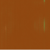
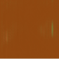

# Game Engine Learning
##### Problem Overview:
The aim of the project is to learn the atari pong game engine. That is, to have a user play a game of pong using our trained neural network instead of the atari game engine.
 The next image in a sequence based on the users input and the previous images is generated. eg if the user presses the up arrow key input, the bar moves up in the next image the network generates and similarly with the down arrow.
 This is based on the paper: <https://arxiv.org/abs/1507.08750>  
 
 ##### Directory overview
 * DataCollection: Collects and saves data as TFRecords
     * Pong-v0: Contains actual data TFRecord files to be used during train, validation and test
         * train: train TFRecord files
         * val: validation TFRecord files
         * test: test TFRecord files
         * mean.npy: mean image from training files for mean centering
    * policy_grad.py: policy gradient network on atari pong open ai game engine (inspired by: <http://karpathy.github.io/2016/05/31/rl/>)
    * episode_collector.py: helper function to save TFRecord files
    * episode_reader.py: helper function to read TFRecord files
    * compute_mean.py: calculates and saves mean image.
 * ModelCheckpoints: Saved model checkpoints restored during training or testing
 * TFBoard: Tensorboard files
 * Utils: Helper functions
     * tf_ops.py: helper function for model layers
     * dshandlehook.py: helper function for run time queue switching between train and val (feedable iterator with state)
 * datapipeline.py: creates run time switchable (with state) multi-threaded buffer based queue pipelines from TFRecords for scale training. Includes pre-processing in pipeline.
 * model.py: model neural network
 * train.py: run to train (monitored training session for checkpoint and tensorboard)
 * test.py: run to test  
  
 ##### Instructions to run
* Data collection: Run policy_grad.py to collect data as TFRecord files in Pong-v0 folder. Create val and test folders and move validation and testing data there. Run compute_mean.py to generate mean image in Pong-v0 folder. Now move train data to train folder.
* Training: Run train.py. Launch tensorboard using files in TFBoard folder to monitor training.
* Testing: Run test.py  

 ##### Results
 
   
 Pong bar moves down in the next image when we press the down arrow key. The model learns to generate the entire image frame using our input key embedding and previous images.